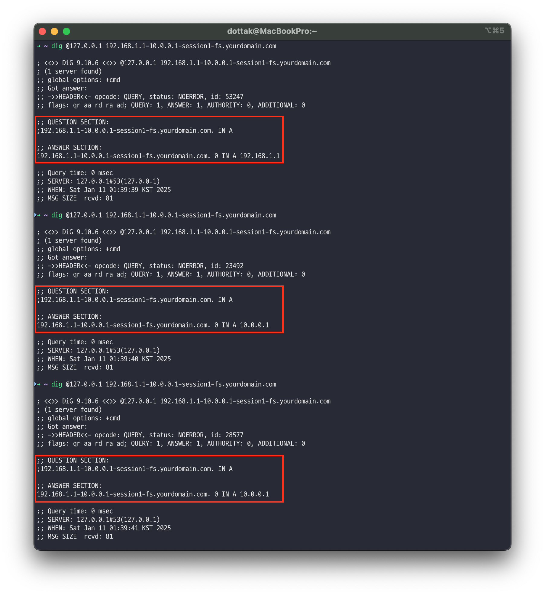
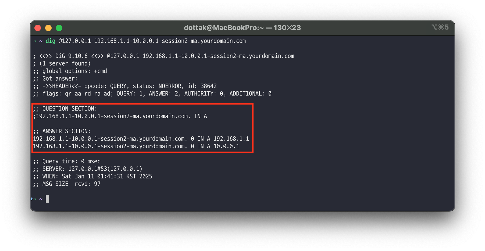
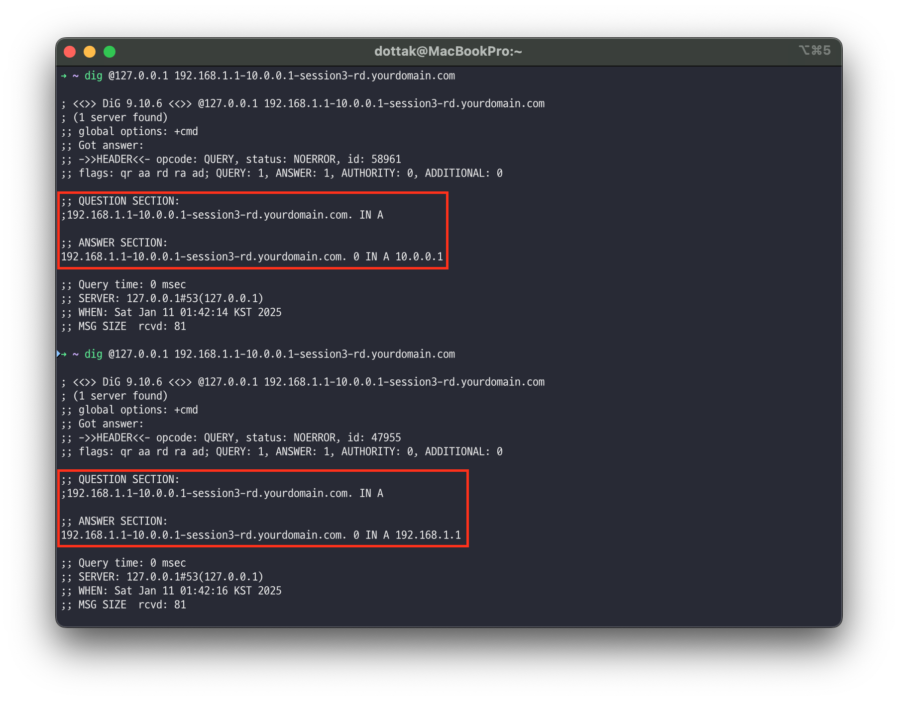

# Simple-Rebinder-DNS-Server

This project is a custom DNS server implementation motivated by the manual DNS request handling feature of the [Singularity Project](https://github.com/nccgroup/singularity). The server is designed to support DNS Rebinding attacks by responding with different IPs based on session-based rules.

## Key Features

- **Custom Domain Handling**: Supports DNS queries ending with specified suffixes (e.g., `rebind.dottak.me`).
- **Session-based Rebinding**: Session state tracking for consistent response patterns.
- **Various Response Modes**:
    - `fs` (First then Second): Returns the first IP for initial query, then always returns the second IP for subsequent queries in the same session.
    - `ma` (Multiple Answers): Returns both IPs at once.
    - `rd` (Random): Randomly returns one of the two IPs.
- **NXDOMAIN Handling**: Returns NXDOMAIN responses for invalid queries or unsupported options.

## Requirements

- Python 3.8 or higher
- `dnslib` library

Install dependencies using the following command:

```
pip install dnslib
```

## Usage

1. Clone this repository and navigate to the project directory.
2. Start the DNS server:
    
    ```
    python rebind_dns.py
    ```
    

The server listens on port `53` and responds to queries according to the specified domain format.

## Configuration

The Rebinding domain suffix can be configured by modifying the `rebinder_dns` parameter when initializing `RebindResolver`:

```
resolver = RebindResolver(rebinder_dns="yourdomain.com")
```

## Query Format

DNS queries must follow this format:

```
{src}-{dst}-{session}-{option}.{rebinder_dns}.
```

- **src**: First IP address
- **dst**: Second IP address
- **session**: Session unique identifier
- **option**: Response mode (`fs`, `ma`, `rd`)

### Examples

### `fs` option (First then Second)

Query: `192.168.1.1-10.0.0.1-session1-fs.yourdomain.com`

- First response: `192.168.1.1`
- Subsequent responses: `10.0.0.1`

```bash
dig @127.0.0.1 192.168.1.1-10.0.0.1-session1-fs.yourdomain.com
```



### `ma` option (Multiple Answers)

Query: `192.168.1.1-10.0.0.1-session2-ma.yourdomain.com`

- Response: Returns both `192.168.1.1` and `10.0.0.1`

```bash
dig @127.0.0.1 192.168.1.1-10.0.0.1-session2-ma.yourdomain.com
```



### `rd` option (Random)

Query: `192.168.1.1-10.0.0.1-session3-rd.yourdomain.com`

- Response: Randomly returns either `192.168.1.1` or `10.0.0.1`

```bash
dig @127.0.0.1 192.168.1.1-10.0.0.1-session3-rd.yourdomain.com
```

